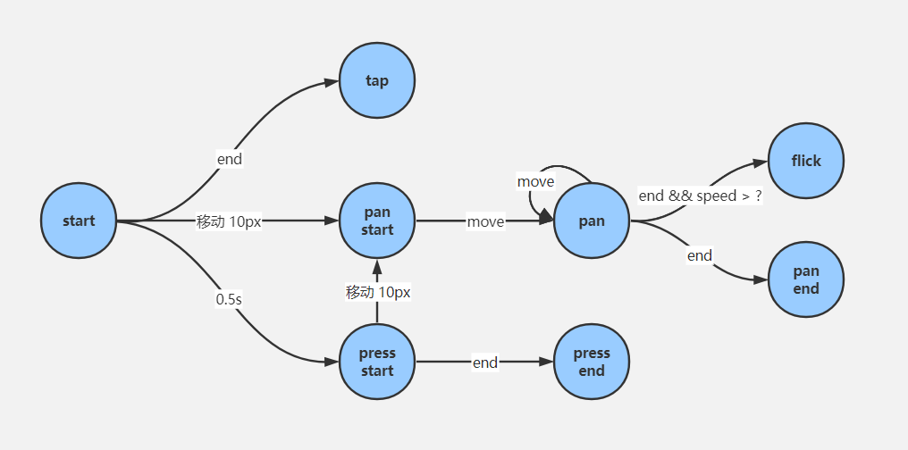

# Week 15 Note

本周主要介绍了手势库组件的实现过程，核心是以下流程图，需要考虑兼容鼠标事件和触摸事件两种模式，组件库根据流程抽象为浏览器标准事件监听、将标准事件监听根据流程图转换为对应的手势事件并 dispatch 自定义事件及其对应参数。

## 手势事件转换关系图（核心）

[flow chart link](https://www.processon.com/embed/60180fd6e401fd1b8daea882)

## 总结

本周课程按照先实现后拆分抽象的方式展示了一个功能库如何从设计、简单实现到提取抽象的过程。特别是从特例执行到抽象逻辑封装拆分的思路，还是很有借鉴意义的。